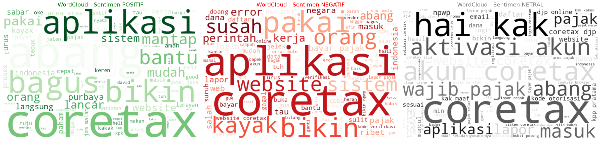
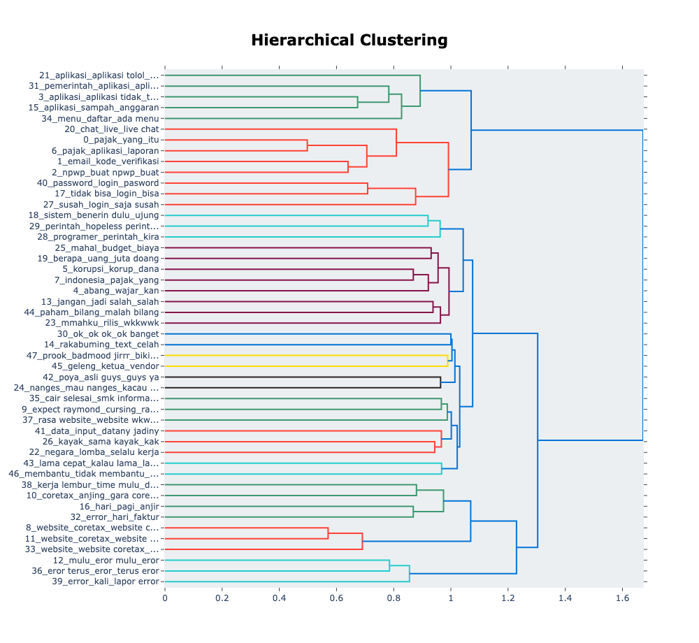
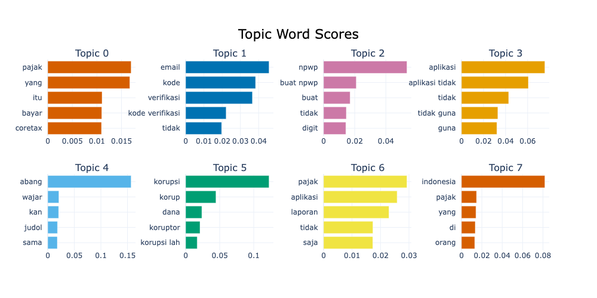

# CoreTax Sentiment Analysis



Project ini bertujuan untuk menganalisis sentimen publik terhadap sistem CoreTax DJP menggunakan data dari YouTube, Play Store, dan Media Sosial.

## Struktur Folder

```
project/
├── data/           
│   ├── processed/  
│   │   ├── CoreTax Preprocessing Results.csv
│   │   └── BERTopic-CoreTax-data.csv
│   ├── Data-Scrape-PlayStore.csv
│   ├── Data-Scrape-YouTube.csv
│   ├── Data-Combined-Twitter-Tiktok.csv
│   ├── kamuskatabaku.xlsx
│   └── ... (Data lainnya)
├── notebooks/      -> Jupyter Notebooks untuk analisis dan eksperimen
│   └── Final_Zenithera_Hackatoon.ipynb
│   └── Zenithera_Analysis-v1.ipynb
├── src/            -> Source code utama (Modular)
│   ├── scraping/       -> Script untuk crawling data
│   │   └── crawl_twitter.py
│   ├── main.py             -> Entry point untuk menjalankan seluruh pipeline
│   ├── config.py           -> Konfigurasi path file
│   ├── data_loader.py      -> Loading dan merging data
│   ├── preprocessing.py    -> Cleaning, normalisasi, stemming
│   ├── sentiment_analysis.py -> Labeling dengan RoBERTa
│   ├── visualization.py    -> Pembuatan plot dan WordCloud
│   ├── topic_modeling.py   -> Analisis topik dengan BERTopic
│   └── verify_integration.py
├── models/         
│   └── bertopic_coretax_model/ -> Model BERTopic yang sudah dilatih
├── outputs/        -> Hasil analisis (plot, visualisasi) dan laporan
│   ├── distribusi-sentiment-setiap-sumber.png
│   ├── documents-and-topics.png
│   ├── hierarchical-clustering.png
│   ├── intertopic-distance-map.png
│   ├── sentiment-coretax.png
│   ├── top-20-TF-IDF-Score.png
│   ├── topic-word-scores.png
│   ├── wordcloud-sentiment.png
│   └── presentation_outline.md
├── requirements.txt -> Daftar library Python yang dibutuhkan
└── README.md       -> Dokumentasi project ini
```

## Cara Menjalankan

1.  **Install Dependencies:**
    ```bash
    pip install -r requirements.txt
    ```
    *Catatan: Untuk crawling Twitter, pastikan Node.js sudah terinstall.*

2.  **Jalankan Pipeline Analisis (Python Script):**
    Untuk menjalankan seluruh proses (Load -> Preprocess -> Sentiment -> Viz -> Topic Modeling):
    ```bash
    python -m src.main
    ```
    *Pastikan dijalankan dari root folder project.*

3.  **Crawling Data Twitter (Opsional):**
    ```bash
    python src/scraping/crawl_twitter.py
    ```

4.  **Jalankan Notebook (Eksperimen):**
    Buka `notebooks/Final_Zenithera_Hackatoon.ipynb` untuk analisis interaktif.

## Fitur Utama
- **Modular Codebase:** Kode dipecah menjadi modul-modul terpisah di `src/` agar lebih rapi dan mudah di-maintain.
- **Data Integration:** Menggabungkan data dari berbagai sumber.
- **Sentiment Analysis:** Menggunakan RoBERTa (`w11wo/indonesian-roberta-base-sentiment-classifier`).
- **Advanced Visualization:** WordCloud, N-grams, Co-occurrence Network.
- **Topic Modeling:** Menggunakan BERTopic untuk menemukan topik utama dalam sentimen negatif.

## Hasil Analisis (Preview)

Berikut adalah beberapa contoh visualisasi yang dihasilkan oleh project ini:

### 1. Distribusi Sentimen


### 2. Hierarchical Clustering


### 3. Topik Word Scores (BERTopic)


*Untuk hasil lengkap, silakan cek folder `outputs/`.*
